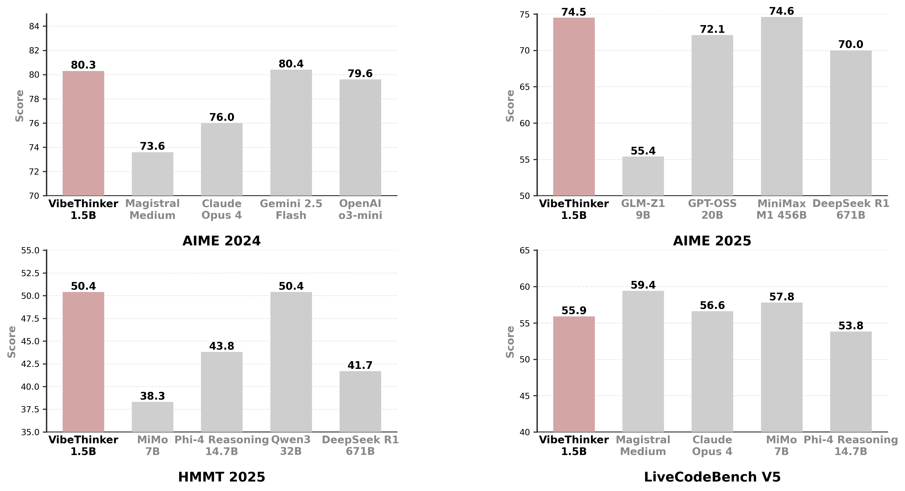

# VibeThinker
<p align="center"></p>

<p align="center">🤗 <a href="https://huggingface.co/WeiboAI">Hugging Face</a>&nbsp&nbsp


## Introduction

VibeThinker-1.5B is a 1.5B-parameter dense model that challenges the prevailing notion that small models inherently lack robust reasoning capabilities. Developed with an innovative post-training methodology centered on the **"Spectrum-to-Signal Principle (SSP)"**, VibeThinker-1.5B demonstrates superior reasoning capabilities compared to closed-source models Magistral Medium and Claude Opus 4, while achieving performance on par with open-source
models like GPT OSS-20B Medium. Most remarkably, it surpasses the initial DeepSeek R1 model—which is over 400 times larger—across
three challenging mathematical benchmarks: AIME24 (80.9 vs. 79.8), AIME25 (73.7 vs. 70.0), and HMMT25 (50.1 vs. 41.7).

<p align="center"></p>

## Key Features

- **Ultra-Efficient**: Only 1.5B parameters - 100× to 600× smaller than giants like Kimi K2 (1000B+) and DeepSeek R1 (671B)
- **Cost-Effective**: Total training cost of **$7,800**
- **Outstanding Capabilities**: VibeThinker-1.5B is the leading model in the sub-3B category, demonstrates superior performance on challenging mathematical and coding benchmarks
- **Innovative Methodology**: SSP framework with Two-Stage Diversity-Exploring Distillation and MaxEnt-Guided Policy Optimization

## Model Downloads

The model checkpoint is available at: [Hugging Face](https://huggingface.co/WeiboAI/VibeThinker-1.5B)

## License

This code repository is licensed under [the MIT License](https://github.com/WeiboAI/VibeThinker/blob/main/LICENSE).

## Citation

If you find our work helpful, feel free to give us a cite.

```

```