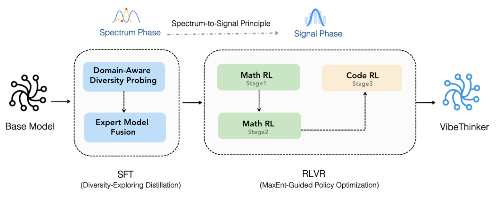

# VibeThinker
<p align="center"></p>

<p align="center">🤗 <a href="https://huggingface.co/WeiboAI">Hugging Face</a>&nbsp&nbsp | &nbsp&nbsp🤖 <a href="https://xxxx">Model Scope</a>   |  &nbsp&nbsp📄  <a href="https://github.com/WeiboAI/VibeThinker/blob/main/VibeThinker-1.5B.pdf">Techical Report</a></p>


## Introduction

VibeThinker-1.5B is a 1.5B-parameter dense model that challenges the prevailing notion that small models inherently lack robust reasoning capabilities. Developed with an innovative post-training methodology centered on the **"Spectrum-to-Signal Principle (SSP)"**, VibeThinker-1.5B demonstrates superior reasoning capabilities compared to closed-source models Magistral Medium and Claude Opus 4, while achieving performance on par with open-source
models like GPT OSS-20B Medium. 

Most remarkably, VibeThinker-1.5B surpasses the initial DeepSeek R1 model—which is over 400 times larger—across three challenging mathematical benchmarks: AIME24 (80.3 vs. 79.8), AIME25 (74.4 vs. 70.0), and HMMT25 (50.4 vs. 41.7).

<p align="center"></p>

## News
[2025.11.05] 📢📢📢 VibeThinker-1.5B will be open-sourced soon. Stay tuned!

## Key Features
- **Ultra-Efficient**: VibeThinker-1.5B redefines the efficiency frontier for reasoning models, achieving state-of-the-art performance in mathematical and coding tasks with only 1.5B parameters—100× to 600× smaller than giants like Kimi K2 (1000B+) and DeepSeek R1(671B). 

<p align="center"></p>

- **Innovative Methodology**: We propose an innovative post-training technique centered on the “Spectrum-to-Signal Principle (SSP)”. This framework systematically enhances output diversity by first employing a “Two-Stage Diversity-Exploring Distillation” in the SFT phase to generate a broad spectrum of solutions, followed by the “MaxEnt-Guided Policy Optimization (MGPO)” framework in the RL phase to amplify the correct signal.

<p align="center"></p>

- **Outstanding Capabilities**: Despite a substantial parameter gap—competing with models 10 to hundreds of times larger—our 1.5B model demonstrates remarkable performance. On the AIME24, AIME25, and HMMT25 benchmarks, it surpasses open-source contenders like DeepSeek R1-0120 and GPT-OSS-20B-Medium, while achieving results comparable to MiniMax-M1.

<p align="center"></p>

- **Cost-Effective**: While state-of-the-art models like DeepSeek R1 and MiniMax-M1 incur post-training costs of $294K and $535K respectively, our approach achieves this for just $7,800. This represents a reduction by a factor of  “30 to 60”, fundamentally changing the economics of developing high-performance reasoning models.

<p align="center"></p>

## Model Downloads

The model checkpoint is available at: [Hugging Face](https://huggingface.co/WeiboAI/VibeThinker-1.5B)

## Eval

The evaluation program and usage guide have been prepared and are available at the following links: [Math Eval](./eval/math/README.md)​ and [Code Eval](./eval/code/README.md).

## License

This code repository is licensed under [the MIT License](https://github.com/WeiboAI/VibeThinker/blob/main/LICENSE).

## Citation

If you find our work helpful, feel free to give us a cite.

```

```