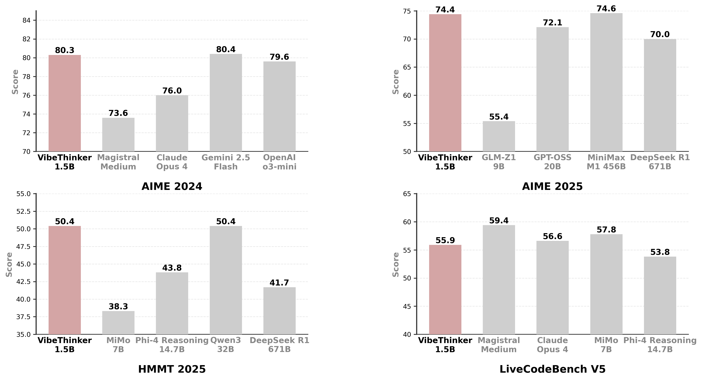
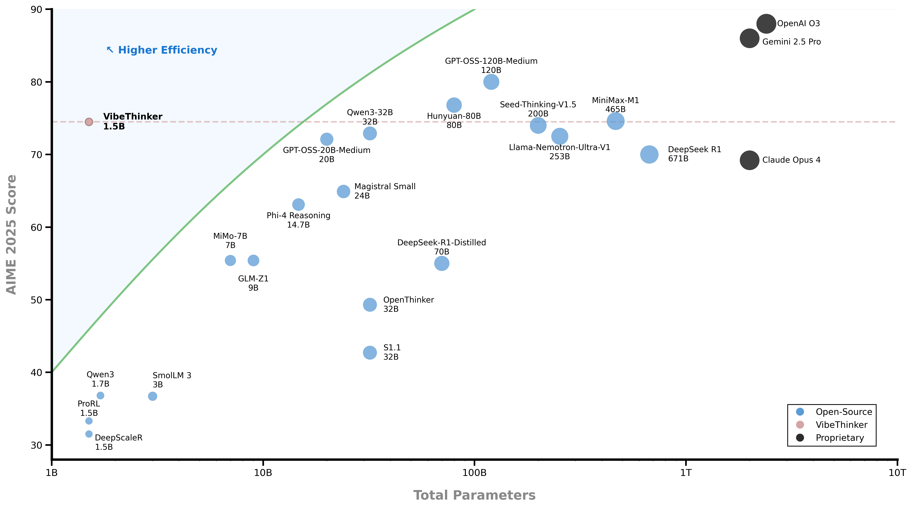

# VibeThinker
<p align="center"></p>

<p align="center">🤗 <a href="https://huggingface.co/WeiboAI">Hugging Face</a>&nbsp&nbsp | &nbsp&nbsp🤖 <a href="https://modelscope.cn/organization/WeiboAI">Model Scope</a> &nbsp  |  &nbsp&nbsp📄  <a href="https://huggingface.co/papers/2511.06221">Techical Report</a> |  &nbsp&nbsp🏆  <a href="https://arxiv.org/abs/2511.06221">arxiv paper</a></p> 

## Introduction

VibeThinker-1.5B is a 1.5B-parameter dense model that challenges the prevailing notion that small models inherently lack robust reasoning capabilities. Developed with an innovative post-training methodology centered on the **"Spectrum-to-Signal Principle (SSP)"**, VibeThinker-1.5B demonstrates superior reasoning capabilities compared to closed-source models Magistral Medium and Claude Opus 4, while achieving performance on par with open-source
models like GPT OSS-20B Medium. 

Most remarkably, VibeThinker-1.5B surpasses the initial DeepSeek R1 model—which is over 400 times larger—across three challenging mathematical benchmarks: AIME24 (80.3 vs. 79.8), AIME25 (74.4 vs. 70.0), and HMMT25 (50.4 vs. 41.7).

<p align="center"></p>

## News
[2025.11.19] 🔥🔥VibeThinker-1.5B hit #1 on huggingface’s trending models today! 

[2025.11.11] 🎉🎉🎉 VibeThinker-1.5B is now open source! The model weights and technical report can be accessed via the links at the top.

[2025.11.05] 📢📢📢 VibeThinker-1.5B will be open-sourced soon. Stay tuned!

## Key Features
- **Ultra-Efficient**: VibeThinker-1.5B redefines the efficiency frontier for reasoning models, achieving state-of-the-art performance in mathematical and coding tasks with only 1.5B parameters—100× to 600× smaller than giants like Kimi K2 (1000B+) and DeepSeek R1(671B). 

<p align="center"></p>

- **Innovative Methodology**: We propose an innovative post-training technique centered on the “Spectrum-to-Signal Principle (SSP)”. This framework systematically enhances output diversity by first employing a “Two-Stage Diversity-Exploring Distillation” in the SFT phase to generate a broad spectrum of solutions, followed by the “MaxEnt-Guided Policy Optimization (MGPO)” framework in the RL phase to amplify the correct signal.

<p align="center"></p>

- **Outstanding Capabilities**: Despite a substantial parameter gap—competing with models 10 to hundreds of times larger—our 1.5B model demonstrates remarkable performance. On the AIME24, AIME25, and HMMT25 benchmarks, it surpasses open-source contenders like DeepSeek R1-0120 and GPT-OSS-20B-Medium, while achieving results comparable to MiniMax-M1.

<p align="center"></p>

- **Cost-Effective**: While state-of-the-art models like DeepSeek R1 and MiniMax-M1 incur post-training costs of $294K and $535K respectively, our approach achieves this for just $7,800. This represents a reduction by a factor of  “30 to 60”, fundamentally changing the economics of developing high-performance reasoning models.

<p align="center"></p>

## Model Downloads

The model checkpoint is available at: [Hugging Face](https://huggingface.co/WeiboAI/VibeThinker-1.5B) and [ModelScope](https://modelscope.cn/models/WeiboAI/VibeThinker-1.5B).

## Eval

If you wish to reproduce the results reported in our technical report, the evaluation program and usage guide have been prepared and are available at the following links.: [Math Eval](./eval/math/README.md)​ and [Code Eval](./eval/code/README.md).

Sample responses from some benchmarks:[here](https://drive.google.com/drive/folders/1qom754QSjujDI98Wv8LIKTaTszPkAN6q?usp=drive_link).

## Usage Guidelines

**We recommend using this model for competitive-style math and coding problems.** 

To facilitate quick verification by the community, we recommend the following parameter settings: **temperature: 0.6 or 1.0, max token length: 40960, top_p: 0.95, top_k: -1.**

## Quick Start

Required: **transformers>=4.54.0**

Recommended for better inference performance: **vLLM==0.10.1 or SGLang>=0.4.9.post6**

Here is a code snippet to show you how to use the chat model with transformers:

```python
from transformers import AutoModelForCausalLM, AutoTokenizer, GenerationConfig


class VibeThinker:
    def __init__(self, model_path):
        self.model_path = model_path
        self.model = AutoModelForCausalLM.from_pretrained(
            self.model_path,
            low_cpu_mem_usage=True,
            torch_dtype="bfloat16",
            device_map="auto"
        )
        self.tokenizer = AutoTokenizer.from_pretrained(self.model_path, trust_remote_code=True)

    def infer_text(self, prompt):
        messages = [
            {"role": "user", "content": prompt}
        ]
        text = self.tokenizer.apply_chat_template(messages, tokenize=False, add_generation_prompt=True)
        model_inputs = self.tokenizer([text], return_tensors="pt").to(self.model.device)

        text = self.tokenizer.apply_chat_template(
            messages,
            tokenize=False,
            add_generation_prompt=True
        )
        model_inputs = self.tokenizer([text], return_tensors="pt").to(self.model.device)

        generation_config = dict(
            max_new_tokens=40960,
            do_sample=True,
            temperature=0.6, # 0.6 or 1.0, you can set it according to your needs
            top_p=0.95,
            top_k=None # in vLLM or SGlang, please set top_k to -1, it means skip top_k for sampling
        )
        generated_ids = self.model.generate(
            **model_inputs,
            generation_config=GenerationConfig(**generation_config)
        )
        generated_ids = [
            output_ids[len(input_ids):] for input_ids, output_ids in zip(model_inputs.input_ids, generated_ids)
        ]

        response = self.tokenizer.batch_decode(generated_ids, skip_special_tokens=True)[0]

        return response


if __name__ == '__main__':
    model = VibeThinker('Your model path')
    prompt = 'Your Prompt'
    print(model.infer_text(prompt))
```

## License

This code repository is licensed under [the MIT License](https://github.com/WeiboAI/VibeThinker/blob/main/LICENSE).

## Citations
If you use VibeThinker in your research or product, please cite:
```
@misc{xu2025tinymodelbiglogic,
      title={Tiny Model, Big Logic: Diversity-Driven Optimization Elicits Large-Model Reasoning Ability in VibeThinker-1.5B}, 
      author={Sen Xu and Yi Zhou and Wei Wang and Jixin Min and Zhibin Yin and Yingwei Dai and Shixi Liu and Lianyu Pang and Yirong Chen and Junlin Zhang},
      year={2025},
      eprint={2511.06221},
      archivePrefix={arXiv},
      primaryClass={cs.AI},
      url={https://arxiv.org/abs/2511.06221}, 
}
```
